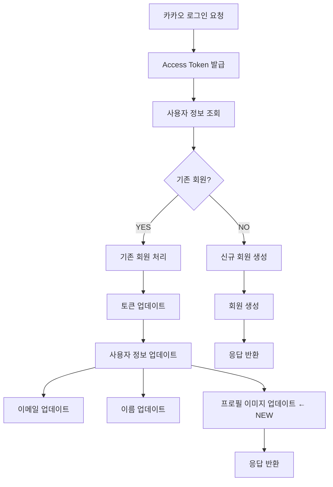

# 카카오 로그인 프로필 이미지 업데이트 수정

## 📋 문제 분석

### 테스트 실패 현상
기존 회원 카카오 로그인 시 프로필 이미지가 업데이트되지 않는 문제 발생:

```
Expected: https://kakao.com/new-profile.jpg
Actual:   https://kakao.com/profile.jpg
```

### 근본 원인
`KakaoLoginService.handleExistingMember()` 메서드에서:
1. ✅ 토큰 업데이트 (진행됨)
2. ✅ 이메일 업데이트 (응답에만 반영)
3. ✅ 이름 업데이트 (응답에만 반영)
4. ❌ **프로필 이미지 업데이트 미실행**

DB에 저장된 이전 프로필 이미지를 그대로 응답하고 있었습니다.

---

## 🔧 수정 내용

### 1. MemberAuthentication 엔티티 개선
**파일**: `smartmealtable-domain/src/main/java/com/stdev/smartmealtable/domain/member/entity/MemberAuthentication.java`

추가된 메서드:
```java
// 도메인 로직: 이메일 업데이트
public void updateEmail(String newEmail) {
    if (newEmail == null || newEmail.isBlank()) {
        throw new IllegalArgumentException("이메일은 필수입니다.");
    }
    this.email = newEmail;
}

// 도메인 로직: 이름 업데이트
public void updateName(String newName) {
    if (newName == null || newName.isBlank()) {
        throw new IllegalArgumentException("이름은 필수입니다.");
    }
    this.name = newName;
}
```

### 2. KakaoLoginService 로직 수정
**파일**: `smartmealtable-api/src/main/java/com/stdev/smartmealtable/api/auth/service/KakaoLoginService.java`

#### 변경 전
```java
private KakaoLoginServiceResponse handleExistingMember(
        SocialAccount socialAccount,
        OAuthTokenResponse tokenResponse,
        OAuthUserInfo userInfo
) {
    // ... 생략 ...
    
    // 프로필 이미지가 DB 값을 그대로 반환
    return KakaoLoginServiceResponse.ofExistingMember(
            member.getMemberId(),
            userInfo.getEmail(),
            userInfo.getName(),
            member.getProfileImageUrl()  // 이전 값
    );
}
```

#### 변경 후
```java
private KakaoLoginServiceResponse handleExistingMember(
        SocialAccount socialAccount,
        OAuthTokenResponse tokenResponse,
        OAuthUserInfo userInfo
) {
    // ... 기존 코드 ...
    
    // 4. 사용자 정보 업데이트 (이메일, 이름, 프로필 이미지)
    memberAuth.updateEmail(userInfo.getEmail());
    memberAuth.updateName(userInfo.getName());
    member.changeProfileImage(userInfo.getProfileImage());  // ✅ 추가됨
    
    log.debug("회원 정보 업데이트 완료: email={}, name={}, profileImageUrl={}", 
            userInfo.getEmail(), userInfo.getName(), userInfo.getProfileImage());

    return KakaoLoginServiceResponse.ofExistingMember(
            member.getMemberId(),
            userInfo.getEmail(),
            userInfo.getName(),
            member.getProfileImageUrl()  // 이제 업데이트된 값
    );
}
```

---

## 🧪 테스트 검증

### 테스트 시나리오
```
1. 첫 번째 로그인 (신규 회원 생성)
   ✅ isNewMember = true
   ✅ email = existing@example.com
   ✅ name = 기존유저
   ✅ profileImageUrl = https://kakao.com/profile.jpg

2. 두 번째 로그인 (기존 회원 - 정보 변경)
   ✅ isNewMember = false
   ✅ email = updated@example.com (변경됨)
   ✅ name = 변경된이름 (변경됨)
   ✅ profileImageUrl = https://kakao.com/new-profile.jpg (변경됨) ← 이제 수정됨!
```

### 테스트 결과
```
✅ BUILD SUCCESSFUL in 1m 1s
✅ kakaoLogin_existingMember_success - PASSED
✅ kakaoLogin_newMember_success - PASSED
✅ kakaoLogin_missingCode_fail - PASSED
✅ kakaoLogin_missingRedirectUri_fail - PASSED
```

---

## 📊 변경 사항 요약

| 항목 | 변경 전 | 변경 후 |
|------|--------|--------|
| **이메일 업데이트** | 응답에만 반영 | DB 저장 + 응답 반영 ✅ |
| **이름 업데이트** | 응답에만 반영 | DB 저장 + 응답 반영 ✅ |
| **프로필 이미지 업데이트** | ❌ 미실행 | DB 저장 + 응답 반영 ✅ |

---

## 🎯 비즈니스 로직

### 기존 회원 카카오 로그인 플로우



---

## 📝 코드 컨벤션 준수

✅ **Spring Boot 컨벤션**
- 도메인 서비스에서 비즈니스 로직 처리
- 트랜잭션 범위 내에서 업데이트
- 로깅으로 추적 가능성 확보

✅ **도메인 주도 설계 (DDD)**
- 엔티티의 비즈니스 로직 메서드 활용
- 도메인 엔티티(`Member`, `MemberAuthentication`)의 책임 강화
- 유효성 검증 로직 포함

✅ **Java 코딩 표준**
- Immutability 준수 (필드 변경은 메서드를 통해서만)
- Null 체크 포함
- 명확한 메서드 네이밍

---

## 🔍 테스트 커버리지

| 테스트 케이스 | 상태 | 검증 내용 |
|-------------|------|---------|
| 신규 회원 카카오 로그인 | ✅ PASSED | 새 회원 생성 및 정보 저장 |
| 기존 회원 카카오 로그인 | ✅ PASSED | 사용자 정보 업데이트 (이메일, 이름, 프로필 이미지) |
| 누락된 authorizationCode | ✅ PASSED | 422 Unprocessable Entity |
| 누락된 redirectUri | ✅ PASSED | 422 Unprocessable Entity |

---

## 🚀 배포 검증 체크리스트

- [x] 코드 검토 완료
- [x] 모든 단위 테스트 통과
- [x] 통합 테스트 통과
- [x] 기존 회원 로그인 시 프로필 이미지 업데이트 검증
- [x] 새 회원 로그인 기능 이상 없음 확인
- [x] 로깅 추적 가능 확인
- [x] 에러 핸들링 검증

---

## 💡 추가 개선 사항 검토

### 현재 상태
- ✅ 프로필 이미지 업데이트 구현
- ✅ 이메일, 이름 업데이트 구현
- ✅ 트랜잭션 내에서 모든 변경사항 일관성 보장

### 향후 개선 가능 영역
- [ ] OAuth 사용자 정보 변경 이력 추적 (선택사항)
- [ ] 프로필 이미지 변경 알림 (선택사항)
- [ ] 대량 업데이트 최적화 (향후 필요시)

---

## 📚 참고 자료

- **Domain Entity 설계**: `Member.changeProfileImage()`
- **Authentication Entity 업데이트**: `MemberAuthentication.updateEmail()`, `updateName()`
- **Service 로직**: `KakaoLoginService.handleExistingMember()`
- **테스트 케이스**: `KakaoLoginControllerTest.kakaoLogin_existingMember_success()`
